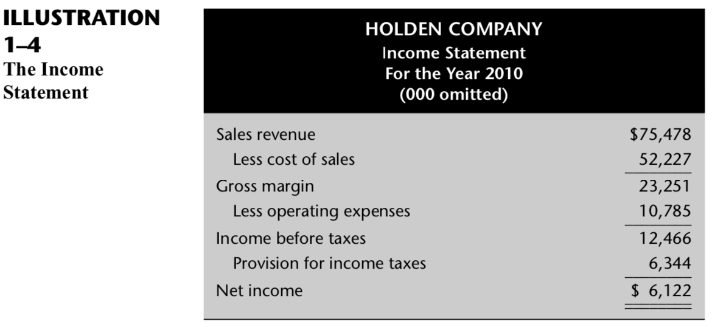

# Chapter-1 The Nature and Purpose of Accounting

> **Accounting** is a system that provides information to the managers of the organization and the parties outside the organization.

## The Need for Information


> Nonquantitative information

 Examples of nonquantitative information are visual impressions,conversations, television programs, and newspaper stories. Accounting is primarily concerned with quantitative information.

> Quantitative information  

 Quantitative information is information that is expressed in numbers. 


> What information is needed about the amounts and financing of the resources used in Varsity Motors and the results achieved by the use of these resources? 

 This information can be classified into four categories:   
 * operating information
 * financial accounting information
 * management accounting information, 
 * tax accounting information. 


### Operating Information

 > A considerable amount of **operating information** is required to conduct an organiza- tion’s day-to-day activities.


### Financial accounting information

 > **Financial accounting information** is intended both for managers and also for the use of parties external to the organization, including shareholders (and trustees in nonprofit organizations), banks and other creditors, government agencies, investment advisers, and the general public. 

### The accounting information

 > **The accounting information** specifically prepared to aid managers is called management accounting information. 


This information is used in three management functions:

* planning
 
  Performed by managers at all levels, in all organizations, `planning` is the process of deciding what actions should be taken in the future.
 
  An important form of planning is `budgeting`. Budgeting is the process of planning the overall activities of the organization for a specified period of time, usually a year. 

  Planning involves `making decisions`. Decisions are arrived at by (1) recognizing that a problem or an opportunity exists, (2) specifying and ranking the criteria to be used to determine the best solution, (3) identifying alternative ways of addressing the problem or opportunity, (4) analyzing the consequences of each alternative, and (5) comparing these consequences to each other and the decision criteria in order to decide which alternative is best. 

* implementation

   The `implementation` of these very specific plans requires supervision on the part of the manager.
 
* control

  The process they use to ensure that employees perform properly is called `control`. 


### Tax Accounting Information

 > Organizations must keep separate `tax accounting` records for tax purposes in those areas where it has elected to use different accounting rules for tax accounting and financial accounting.


### Definition of Accounting

 > American Accounting Association committee `defined accounting as` the process of identifying, measuring, and communicating economic information to permit informed-(有见识的) judgments and decisions by users of the information.

 > 会计是辨识，计量和反映经济信息的过程，这个过程产出的数据可以让使用它的人做出明智的判断和决定。


## The Profession of Accounting

 - `CPAs` Certified Public Accountants(注册会计师)
  
   Most independent public accountants are licensed by their state and are designated as CAPs.

 * `AICPA` American Institute of Certified Public Accountants(美国注册会计师协会)
  
   The AICPA is the professional organization of CPAs.

 * `IMA` Institute of Management Accountants (管理会计师协会)
  
   Many accountants employed by industry belong to the IMA.

 * `CMA` Certified Management Accountant (注册管理会计师)
  
   The IMA administers the CMA program.

 * `CIA` Certified Internal Auditors (注册内部审计师)

   Some accountants in industry also are CIA.

 * `AAA` American Accounting Association (美国会计协会)

   Many college and university accounting faculty members belong to the AAA.

 - `SEC` Securities and Exchange Commission(证券交易委员会)

   The SEC was created by the Securities Act of 1934. Its mission is to protect in- vestors; maintain fair, orderly, and efficient securities markets; and facilitate capital formation. 

 - `PCAOB` Public Company Accounting Oversight Board(上市公司会计监督委员会)  

   PCAOB is a five-person board appointed by the SEC to oversee the auditors of public companies in order to protect the interests of investor and further the public interest in the preparation of informative, fair, and independent audit reports.

   CPAs that audit public companies are subject to the oversight of the SEC and the PCAOB.

  


> `The ultimate responsibility` for the generation of accounting information—whether financial or managerial—rests with management.

  
## Our Approach to Accounting

> We focus on what the user needs to know about accounting. 


## The Financial Accounting Framework

> Accounting has evolved over a period of many centuries, and during this time certain terminology, rules, and conventions have come to be accepted as useful. If you are to understand accounting reports—the end products of an accounting system—you must be familiar with the rules and conventions lying behind these reports.

### Accounting as a Language

> Accounting is aptly called the language of business.

### Different Formats

 - `XBRL` eXtensible Business Reporting Language(可扩展的业务报告语言)
  
   XBRL is a digital business language designed to help companies communicate financial statement data internally and externally. 
   
   XBRL does not adjust data for differences in accounting principles.  
   Its principal purpose is to adjust presentational differences. 

### Nature of Principles   

> The rules and basic concepts of accounting are commonly referred to as principles. The word principle is here used in the sense of a general law or rule that is to be used as a guide to action. This means that accounting principles do not prescribe exactly how each event occurring in an organization should be recorded.


### Criteria

 - relevant
 
   A principle has `relevance` to the extent that it results in information that is meaningful and useful to those who need to know something about a certain organization. 
  
 - objectivity

   A principle has `objectivity` to the extent that the resulting information is not influenced by the personal bias or judgment of those who furnish it. Objectivity connotes reliability, trustworthiness. It also connotes verifiability, which means that there is some way of finding out whether the in- formation is correct. 

 - feasibility

   A principle has `feasibility` to the extent that it can be implemented without undue complexity or cost.


### Source of Accounting Principles

 - GAAP generally accepted accounting principles(通用审计标准)

 - [FASB](http://www.fasb.org) Financial Accounting Standards Board(财务会计标准委员会)

 - There is a major effort to codify a set of accounting principles that would apply internationally, and over 40 statements known as `International Accounting Standards (IAS)` have been published by the International Accounting Standards Committee (IASC)—now reorganized as the `International Accounting Standards Board (IASB)`—located in London, England. While retaining the name IAS for standards issued by its predecessor, standards issued by the [IASB](http://www.iasb.org) are known as `International Financial Reporting Standards (IFRS)`.


### Principles Vs. Rules

> A major controversy in accounting is the extent to which accounting standards should be expressed in the form of broad principles versus detailed rules.

> As GAAP and IFRS converge, it is anticipated that GAAP will become more principle based.


## Financial Statements

> The end product of the financial accounting process is a set of reports that are called `financial statements`. 

- a statement of financial position, which is generally referred to as a balance sheet
- an income statement
- a statement of cash flows
 
> Most reports, in any field, can be classified into one of two categories:

- stock, or status, reports
 
  Reports of stocks are always as of a specified instant in time;   
  e.g. The balance sheet

- flow reports. 

  reports of flow always cover a specified period of time.  
  e.g. the income statement and the cash flow statement


### The Balance Sheet


- `Assets` are valuable resources owned by the entity.
- `Liabilities` are obligations of the entity to outside non owner parties who have furnished resources. 
- These parties are generally called `creditors` because they have extended credit to the entity. 
- Creditors have a `claim` against the assets in the amount shown as the liability.
- The other source of the funds that an entity uses to acquire its assets is called `Owners’ Equity`.

  1. the amount provided directly by equity investors, which is called `Total Paid-In Capital`.
  
  2. the amount retained from profits (or earnings), which is called `Retained Earnings`.

- Equity investors have only a `residual claim`.  If the entity is dissolved, they get whatever is left after the liabilities have been paid, which may be nothing.

- Liabilities therefore are a `stronger claim` against the assets than equity.

#### Dual-Aspect Concept

> The assets that remain after the liabilities are taken into account will be claimed by the equity investors. 

```
Assets = Liabilities + Owners'Equity
```

 - any assets not claimed by creditors will be claimed by equity investors and 
 
 - the total amount of claims (liabilities + owners’ equity) cannot exceed what there is to be claimed, it follows that the total amount of assets will always be equal to the total amount of liabilities plus owners’ equity.

 - The fact that total assets must equal, or balance, total liabilities plus owners’ equity is why the statement is called a balance sheet.

 - This equality tells nothing about the entity’s financial condition; it always exists unless the accountant has made a mistake.

 - This equality exists even if liabilities are greater than assets. In this circumstance the Owners'Equity would be a negative amount(是一个负数).

 - The term `net assets` is sometimes used instead of owners’ equity.


### The Income Statement



The basic income statement equation is

```
Revenues - Expenses = Net income
```

The difference between sales and cost of sales is called `gross margin`. Thus,

```
Gross margin = Sales revenue - Cost of Sales
```

`Operating expenses` are subtracted from gross margin, leaving `income before taxes`.

### “Package” of Financial Reports


### Sarbanes-Oxley Act


### Income Tax Reporting


## Summary

An organization has four types of accounting information: (1) operating information, which has to do with the details of operations; (2) management accounting information, which is used internally for planning, implementation, and control; (3) financial accounting informa- tion, which is used both by management and by external parties; and (4) tax accounting in- formation, which is used to file tax returns with taxing authorities.

Financial accounting is governed by ground rules that in America are referred to as gen- erally accepted accounting principles. The rules attempt to strike a balance between the criterion of relevance on the one hand and the criteria of objectivity and feasibility on the other.

The end products of the financial accounting process are three financial statements: the balance sheet, the income statement, and the cash flow statement. The balance sheet is a report of status or stocks as of a moment of time, whereas the other two statements sum- marize flows over a period of time.

In the United States, calculating taxable income for income tax purposes differs from the process of calculating income for the financial accounting income statement.

The basic accounting equation is
```
Assets = Liabilities + Owners’ equity
```

