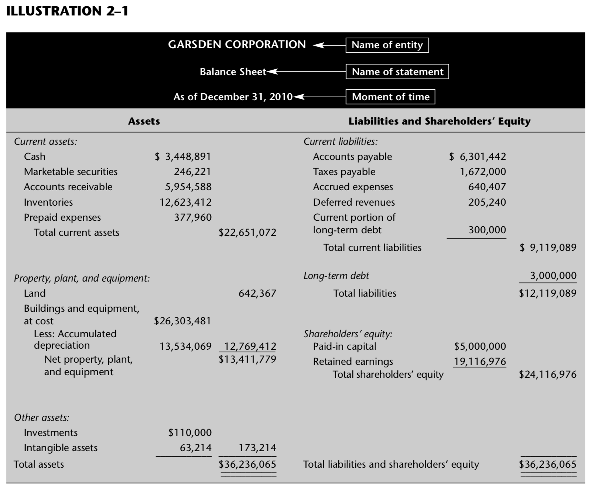

# Chapter-2 Basic Accounting Concepts: The Balance Sheet

> This chapter describes 5 of the 11 basic concepts from which principles of accounting are derived.

1. Money measurement(货币计量)
2. Entity(会计主体)
3. Going concern(持续经营)
4. Cost(成本)
5. Dual aspect(复式记账)
---
6. Accounting period(会计分期)
7. Conservatism(稳健性)
8. Realization(实现)
9. Matching(配比)
10. Consistency(一致性)
11. Materiality(重要性)


## Basic Concepts

### The Money Measurement Concept

> In financial accounting, a record is made only of information that `can be expressed in monetary terms`. The advantage of such a record is that money provides `a common denominator` by means of which heterogeneous facts about an entity can be expressed as numbers that `can be added and subtracted`.


> The money measurement concept imposes a severe limitation on the scope of an accounting report. So the reader of an accounting report should not expect to find therein all of the facts, or perhaps even the most important ones, about an organization.(e.g.the president’s health)

> Money is expressed in terms of its value at the time an event is recorded in the accounts. Subsequent changes in the purchasing power of money do not affect this amount.(e.g.  a machine purchased in 2010 for $200,000 and land purchased 20 years earlier for $200,000 are each listed in the 2010 accounting records at $200,000)

### The Entity Concept

> Accounts are kept for entities, as distinguished from the persons who are associated with these entities. An `entity` is any organization or activity for which accounting reports are prepared.


### The Going-Concern Concept

> Unless there is good evidence to the contrary, accounting assumes that an entity is a `going concern`—that it will continue to operate for an indefinitely long period in the future. 

> The significance of this assumption can be indicated by contrasting it with a possible alternative, namely, that the entity is about to be `liquidated`.


### The Cost Concept

> The economic resources of an entity are called its `assets`.

- nonmonetary assets (e.g. land, buildings, and machinery, and other similar assets whose cash value is not fixed by contract)

- monetary assets (e.g. money and marketable securities and other similar assets whose cash value is fixed by contract)

#### Nonmonetary Assets

> In accounting, all assets are initially recorded at their cost. (For emphasis, this is also referred to as an asset’s historical cost.) In the case of nonmonetary assets, this amount is ordinarily unaffected by subsequent changes in the value of the asset. 

#### Rationale for the Cost Concept

> 是权衡relevance, objectivity, and feasibility 三者之后做的一个折中
  
  - 不够 relevance 因为他给出的不是 nonmonetary asset 当前的价值
  - 相对 objectivity ,是跟每次都评估资产的当前价值这种方法比，因为每次都评估会很困难而且相对会很主观
  - 更可行 The cost concept leads to a much more feasible system of accounting for nonmonetary assets. 
  - So adherence to the cost concept when accounting for nonmonetary assets indicates a willingness on the part of the accounting profession to sacrifice some degree of relevance in exchange for greater objectivity and greater feasibility.

    sacrifice sth in exchange for sth 不错的句型


> The purpose of the `amortization` process is to remove systematically the cost of the asset from the asset accounts and to show it as a cost of operations. 

#### Monetary Assets

> Monetary assets are initially recorded at their cost and, in the case of most monetary assets, subsequently accounted for at their fair value. 


#### Rationale for Fair Value

> The use of fair value to account for most monetary assets subsequent to their acquisition satisfies the three basic criteria of `relevance`, `objectivity`, and `feasibility` used to judge the acceptability of an accounting principle. Clearly a monetary asset’s fair value is relevant to readers of accounting reports, and the fair value of many monetary assets can readily be determined objectively and at a low cost.

#### Goodwill

> It follows from the cost concept that if an entity pays nothing for an item it acquires (other than as a donation), this item will usually not appear on the accounting records as an asset. 

> Goodwill appears in the accounts of a company only when the company has purchased another company, when one company buys another company and pays more than the fair value of its net assets.

> representing the value of the name, reputation, clientele, or similar intangible resources of the purchased company.


### The Dual-Aspect Concept

> The economic resources of an entity are called `assets`. The claims of various parties against these assets are called `equities`. 

There are two types of equities

- liabilities
  
  which are the claims of creditors, everyone other than the owners of the business

-  owners’ equity

   which is the claims of the owners of the business.  
   Owners’ equity for an incorporated business is commonly called shareholders’ equity.


```
//This is the fundamental accounting equation expressed in its general form
Assets = Equities

Equities = Liabilities + Owners' Equity
```

- Events that affect the numbers in an entity’s accounting records are called `transactions`.

- Every transaction has a dual impact on the accounting records. Accounting systems are set up to record both of these aspects of a transaction; this is why accounting is called a `double-entry` system.


## The Balance Sheet

> Its more formal name is `a statement of financial position`.



### An Overall view

The `balance sheet` can be interpreted in either of two ways, both of which are correct.

- Resources and Claims View

  It has the difficulty of interpreting shareholders’ equity as a claim(因为如果是清算有个先后顺序，shareholders' equity 是后清算的，可能什么都没有。如果不是清算情况，那么资产是按购买录入的，并没有反应当前价值). 


  The notion of “claiming” assets is rather legalistic, and has the most meaning if a company is being liquidated in bankruptcy—which is inconsistent with the going- concern concept.（缺点） 

  In certain circumstances, the resources and claims view is easier to understand.(优点)


- Sources and Uses of Funds View

  The sources and uses of funds view usually provides a more meaningful interpretation.


> Thus, with the sources and uses of funds view, the fundamental accounting equation, Assets 􏰁 Liabilities 􏰂 Owners’ equity, has this interpretation: Every dollar invested in the entity’s assets was supplied either by the entity’s creditors or by its owners; and every dollar thus supplied is invested in some asset.


### Account Categories

> It is more practicable and more informative to summarize and group related items into classifi- cations or account categories.

As in any classification scheme, the categories are defined so that :

 - the individual items included in a category resemble one another in significant respects.

 - the items in one category are essentially different from those in all other categories.


### Assets

> `Assets` are economic resources that are controlled by an entity and whose cost (or fair value) at the time of acquisition could be objectively measured. 

The four key points in this definition are：

1. an asset must be acquired in a transaction

2. an asset must be an economic resource

3. the resource must be `controlled` by the entity
  
   Control is an accounting concept similar to, but not quite the same as, the legal concept of ownership.

4. its cost (or fair value) at the time of acquisition must be objectively measurable

   The `objective measurability` test is usually clear-cut, but in some instances it is difficult to apply.

> On most business balance sheets, assets are listed in decreasing order of their liquidity, that is, in order of the promptness with which they are expected to be converted into cash.

#### Current Assets

> Cash and other assets that are expected to be realized in cash or sold or consumed during the normal operating cycle of the entity or within one year, whichever is longer, are called `current assets`. 

- `Cash` consists of funds that are readily available for disbursement. 

- `Marketable securities` are investments that are both readily marketable and ex- pected to be converted into cash within a year.

- `Accounts receivable` are amounts owed to the entity by its customers. 

   Amounts owed the entity by parties other than customers would appear under the heading `notes receivable` or `other receivables` rather than as accounts receivable. If the amounts owed to the company are evidenced by written promises to pay, they are listed as `notes receivable`

- `Inventories` are the aggregate of those items that are either 
   
  (1).held for sale in the or- dinary course of business
  
  (2).in process of production for such sale
  
  (3).soon to be consumed in the production of goods or services that will be available for sale.

- `Prepaid expenses` represent certain assets, usually of an intangible nature, whose usefulness will expire in the near future. 


#### Property, Plant, and Equipment

> `Noncurrent assets` consists of assets that are tangible and relatively long-lived. The term `fixed assets` is also used for this category. 


#### Other Assets

- `Investments` are securities of one company owned by another either in order to control the other company or in anticipation of earning a long-term return from the investment. 

- `Intangible assets` include goodwill (briefly described earlier), patents, copyrights, trademarks, franchises, and similar valuable but nonphysical things controlled by the business. 


### Liabilities

> `Liabilities` are obligations to transfer assets or provide services to outside parties arising from events that have already happened. 

> `Liabilities` are claims against the entity’s assets. Unless otherwise noted, an individual liability is not a claim against any specific asset or group of assets. 


#### Current Liabilities

> Liabilities that are expected to be satisfied or extinguished during the normal operating cycle or within one year, whichever is longer, are called `current liabilities`.

- `Accounts payable` represent the claims of suppliers arising from their furnishing goods or services to the entity for which they have not yet been paid. 

- `Taxes payable` shows the amount that the entity owes government agencies for taxes.

- `Accrued expenses` represent amounts that have been earned by outside parties but have not yet been paid by the entity. (e.g. Interest earned by a lender but not yet paid by the entity)

- `Deferred revenues` (also called `unearned revenues`) represent the liability that arises because the entity has received advance payment for a service it has agreed to render in the future. (e.g. subscription revenues)

- `Current portion of long-term debt` represents that part of a long-term loan that is due within the next 12 months.

#### Other Liabilities

> Those obligations that do not meet the criteria for being classified as current liabilities are simply called `other liabilities`. They are also sometimes called `noncurrent liabilities` or `long-term debt`.

### Owners’ Equity

> The `owners’ equity` section of the balance sheet shows the amount the owners have invested in the entity. 

> In a corporation, the ownership interest is evidenced by shares of stock, and the owners’ equity section of its balance sheet is therefore usually labeled `shareolders’ equity` or `stockholders’ equity`.


### Paid-In Capital

The shareholders’ equity of balance sheet is divided into two main categories.

1. `Paid-in capital` or `contributed capital`, is the amount the owners have
invested directly in the business by purchasing shares of stock as these shares were issued by the corporation.

   Paid-in capital in most corporations is further subdivided into `capital stock` and `additional paid-in capital`.


2. `Retained earnings` is the difference between the total earnings of the entity from its inception to date and the total amount of dividends paid out to its shareholders over its entire life.

   If the difference is negative, the item usually is labeled `deficit` rather than retained earnings.

> Owners’ equity is also sometimes called `net assets`, since the amount shown for owners’ equity is always equal to assets net of (i.e., minus) liabilities. 


#### Unincorporated Businesses

> In a `proprietorship`—a business owned by one person—the owner’s equity is customarily shown as a single number with a title such as “Lee Jones, capital,”.


```
Assets = Liabilities + Paid-in capital + Retained earnings
```


## Ratios

> A `atio` is simply one number expressed in terms of another. (e.g. current assets of $22,651,072 and current liabilities of $9,119,089, the ratio of its current assets to its current liabilities is $22,651,072 ÷ $9,119,089, or 2.5 to 1.)

> The ratio of current assets to current liabilities is called the `current ratio`.