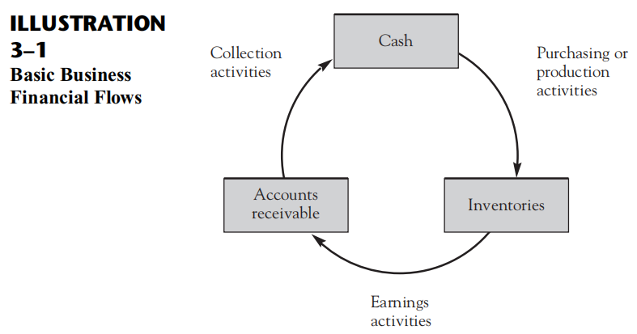

# The Income Statement

> In the course of this discussion, we shall explain the last 6 of 11 basic concepts listed in Chapter 2:

6. Accounting period
7. Conservatism
8. Realization
9. Matching
10. Consistency
11. Materiality

## The Nature of Income

> The Income Statement is a `flow report` , as contrasted with the balance sheet, which is a `status report`.

 - in terms of flows through time -flow report
 - in terms of its status or state as of one moment in time -status report

- Cash

  The entity has obtained from investors or from past profitable operations.  
  The entity uses this cash to acquire inventories,either 

- Inventories
 
- Accounts receivable

> For most types of businesses, the income statement focuses on the section of the flow diagram that is labeled `earning activities` -`operating activities` or `operations`.

> Essentially, this reports consists of two elements.

- the inflows of assets are called `revenues`
- the outflows of resuorces that were required in order to generate these revenues are called `expenses` 
- profit (more formally, `income`) is the amount by which revenues exceed expenses.
- `net income` is used to refer to the net excess of all the revenues over all the expenses.
- `net loss` is used to refer to the difference of total expense exceed total revenues.

## Basic Concepts

### The Accounting Period Concept