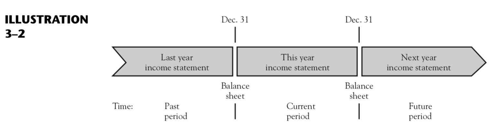

# The Income Statement


> In the course of this discussion, we shall explain the last 6 of 11 basic concepts listed in Chapter 2:

6. Accounting period
7. Conservatism
8. Realization
9. Matching
10. Consistency
11. Materiality


## The Nature of Income

> The Income Statement is a `flow report` , as contrasted with the balance sheet, which is a `status report`.

 - in terms of flows through time -flow report
 - in terms of its status or state as of one moment in time -status report


- Cash

  The entity has obtained from investors or from past profitable operations.  
  The entity uses this cash to acquire inventories,either by purchasing goods from others or by producing them itself.

- Inventories
 
- Accounts receivable

> For most types of businesses, the income statement focuses on the section of the flow diagram that is labeled `earning activities` -`operating activities` or `operations`.

> Essentially, this reports consists of two elements.

- the inflows of assets are called `revenues`
- the outflows of resuorces that were required in order to generate these revenues are called `expenses` 
- profit (more formally, `income`) is the amount by which revenues exceed expenses.
- `net income` is used to refer to the net excess of all the revenues over all the expenses.
- `net loss` is used to refer to the difference of total expense exceed total revenues.

## Basic Concepts

### The Accounting Period Concept

why need The Accounting Period Concept

>  Management and other interested parties are unwilling to wait until the business has ended before obtaining information on how much income has been earned. They need to know at frequent intervals how things are going.

> `accounting period concept`: Accounting measures activities for a specified interval of time, called the accounting period.

>  In the majority of businesses, the accounting year, or `fiscal year`, corresponds to the calendar year; but many businesses use `the natural business year` instead of the calendar year.

#### Interim report

> Management needs information more often than once a year. Income statements for management are therefore prepared more frequently.(e.g. a month, a week or a day) These reports are called `interim reports` to distinguish them from the annual reports. 

#### Relation between Income and Owners’ Equity

> The net income of an accounting period `increases owners’ equity`. More specifically for a corporation, net income increases retained earnings.

> net increases in retained earnings are called income.

> There are only two ways in which earnings activities—that is, operations—can affect retained earnings: They can increase it or they can decrease it.

#### Revenues and Expenses

> A `revenue` is an increase in retained earnings resulting from the operations of the entity, and an `expense` is a decrease.

```txt
Revenues - Expenses = Net income
```

#### Income Not the Same as Increase in Cash

> It is extremely important to understand that the income of a period is associated with changes in retained earnings and that it has no necessary relation to changes in cash during that period.

> The increase in cash may merely be offset by a decrease in some other asset or by an increase in a liability, with no effect on retained earnings at all.

> Although individuals typically measure their personal income by the amount of money they receive, this concept of income is not correct when applied to a business entity.


### The Conservation Concept

> There is a preference for using the smaller number when measuring assets or revenues, and the larger for liabilities or expenses.

We state the conservatism concept’s two aspects somewhat more formally:

- Recognize revenues(increase in retained earnings) only when they are reasonably certain.

- Recognize expenses(decrease in retained earnings) as soon as they are reasonably possible.


#### Application to Revenue Recognition

> In general, revenue from the sale of goods is recognized in the period in which goods were delivered to customers. Revenue from the performance of services is recognized in the period in which the services were performed. 

- Precollected Revenue

  The liability,`procollected(or unearned) revenue`, represents the company's obligation to provide its subscribers the future issues of the magazine for which they have already paid.

  `Precollected revenues` have been paid to the entity but have not as yet been earned by the entity.





- Accounts Receivable

  The converse of the `precollected revenue` is illustrated by sales mad on credit: The custome agrees to pay for the goods or services sometime after the date on which they are actually received.

  The revenue is recognized in the period in which the sale is made.

  The `sale` is the earnings transaction that affects retained earnings.


|Name|Amount|Cash Receipts|Sales Revenue|
|--|--|--|--|
|1.Cash sales made this year|200|200|200|
|2.Credit sales made last year;<br>cash received this year|300|300|0|
|3.Credit sales made this year;<br>cash received this year|400|400|400|
|4.Credit sales made this year;<br>cash received next year|100|0|100|
|Total||900|700|

- Accrued Revenue

> `Accrued Revenue` is the reverse of precollected revenue: Accrued revenues have been earned by the entity but have not as yet been paid to the entity.

### The Realization Concept

> `The Realization Concept`, indicates the amount of revenue that should be recongnized from a given sale.

- `Realization` refers to inflows of cash or claims to cash(e.g. accounts receivable) arising from the sale of goods or services.

  e.g. If the list price is $25,000 and the car is actually sold for $23,500, then the revenue is $23,500.

  e.g. If a store makes credit sales of $100,000 during a period and if experience indicates that 3 percent of credit sales will eventually become bad debts, the amount of revenue for the period is $97,000, not $100,000.

  ### The Matching Concept

  > `The Matching Concept`: When a given event affects both revenues and expenses, the effect on each should be recognized in the same accounting period.

  >  有了收入需要为当期收入匹配当期支出，也有可能先有支出再匹配当期收入

  ## Recognition of Expenses

